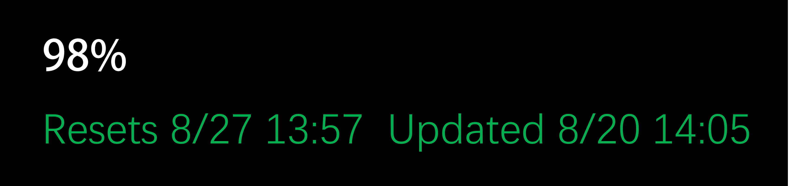

# Codex Weekly Usage Widget

A lightweight Windows desktop widget that shows your<br>
remaining Codex weekly usage, reset time, and last update time.

[简体中文](README.zh-CN.md)

<p align="center">
  
</p>

## Features

- Remaining weekly Codex usage
- Reset time
- Last successful update time
- Lightweight floating desktop widget
- No third-party Python dependencies
- Windows startup support

> **Unofficial tool:** This project is not affiliated with OpenAI. It reads the
> local Codex sign-in state and uses a private Codex usage endpoint. The endpoint,
> authentication format, or applicable terms may change without notice.

## Installation

Requirements:

- Windows 10 or Windows 11
- Python 3.10 or later, including the `py` / `pyw` launcher
- An active Codex sign-in that has been used at least once

This project uses only the Python standard library.

Run from the project directory:

```powershell
py -3 codex_weekly_widget.py
```

Or double-click `start_widget.bat` to start the widget without opening a console window.

### Windows startup

```powershell
powershell -ExecutionPolicy Bypass -File .\install_startup.ps1
```

The script creates a shortcut in the current user's Startup folder. Delete that shortcut to disable startup.

## How it works

1. The widget first requests `https://chatgpt.com/backend-api/wham/usage`.
2. It reads the existing local sign-in state from `%USERPROFILE%\.codex\auth.json`.
3. If the endpoint is temporarily unavailable, it falls back to quota response records in `%USERPROFILE%\.codex\logs_2.sqlite`.
4. It supports the current `primary` weekly bucket and the older `secondary` weekly bucket.
5. The interface refreshes every 2.5 seconds; the usage endpoint is requested at most every 30 seconds.
6. If no fresh quota response is seen for 15 minutes, the widget shows `--%` instead of presenting stale data as live.

## Privacy and security

- The widget does not provide a proxy or account-storage service; reads happen locally.
- Never commit `auth.json`, cookies, tokens, local databases, logs, or account screenshots.
- The repository's `.gitignore` covers common credential and runtime files, but review the staged diff before publishing.
- This project uses a private, non-stable endpoint and may stop working after a Codex update.
- Read [SECURITY.md](SECURITY.md) and the [OpenAI Terms of Use](https://openai.com/policies/terms-of-use/) before distributing it.

## Troubleshooting

If the widget shows `--%`:

1. Confirm that Codex is signed in and has made a normal request recently.
2. Confirm `%USERPROFILE%\.codex\auth.json` exists and the sign-in state is valid.
3. Check whether a firewall, proxy, or network policy blocks `chatgpt.com`.
4. After a Codex update, the private endpoint fields may have changed. Share only a redacted error description in an issue—never upload tokens or complete logs.

## Development

Run the unit tests:

```powershell
py -3 -m unittest discover -s . -p "test_*.py" -v
```

GitHub Actions runs compilation and unit tests on Windows with Python 3.10–3.13 using fixed, redacted fixtures. CI never accesses a real Codex account.

## Project structure

```text
codex_weekly_widget.py       # Widget and quota reader
test_codex_weekly_widget.py  # Unit tests
start_widget.bat             # Manual launcher
install_startup.ps1          # Startup shortcut setup
github.jpg                   # README screenshot
SECURITY.md                  # Security policy
CONTRIBUTING.md              # Contribution guide
CHANGELOG.md                 # Change history
```

## License

This project is released under the [MIT License](LICENSE).

